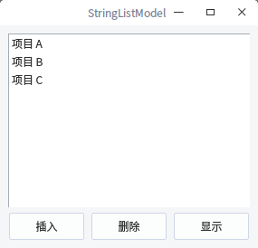

# QStringListModel
从最简单的 QStringListModel 开始学习 Qt 的 MVC (Model View Controller) 模型－视图－控制器 设计。  
已编译好的 StringListModel 程序适用 64 位 Linux 系统 Qt5 环境，双击运行，其他版本请自行编译。  

  

#### 参考：
https://www.cnblogs.com/lvdongjie/p/4813572.html

#### 总结：
可以看出，几乎所有操作都是针对 Model 的，我们对 Model 进行操作，当 Model 检测到数据发生了变化，会立刻通知 View 刷新。这样，我们就可以把精力集中在对数据的操作上，而不用担心视图的同步显示问题，这正是 Model-View 模型的优势所在。